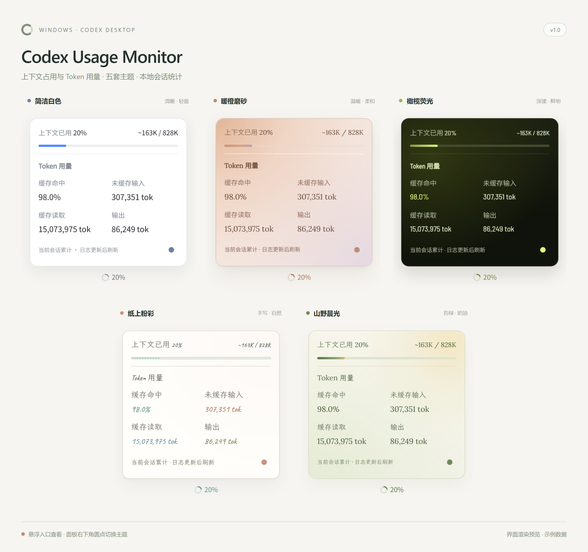

# Codex Usage Monitor 1.0

在 Codex 客户端中显示上下文占用和 Token 用量，支持五套主题。

## 效果预览




## 1. 准备环境

先安装官方 Codex 客户端，并确保电脑已安装 Node.js 22 或更高版本。

推荐先下载并安装 **PowerShell 7 稳定版**：[微软官方安装说明](https://learn.microsoft.com/zh-cn/powershell/scripting/install/installing-powershell-on-windows)。也可以在终端执行：

```powershell
winget install --id Microsoft.PowerShell --source winget
```

安装完成后，关闭并重新打开终端。

## 2. 安装 Monitor

完整解压安装包，打开 `codex-usage-monitor-windows-1.0.0` 文件夹，在文件夹空白处右键，选择“在终端中打开”。确认当前路径下能看到 `install.ps1`，执行：

```powershell
pwsh -NoProfile -ExecutionPolicy Bypass -File .\install.ps1
```

安装成功后，桌面会生成 **Codex Usage Monitor** 图标。请保留安装包内的文件，不要删除 `NOTICE.md`、`VERSION` 等安装清单要求的文件。

## 3. 启动与使用

1. 保存正在进行的工作，彻底退出 Codex，关闭所有 Codex 窗口；如果托盘里仍有 Codex，请选择“退出”。
2. 双击桌面新生成的 **Codex Usage Monitor** 图标，打开 Codex。
3. 鼠标悬浮在模型名称左侧的圆环和百分比上，即可查看统计面板；移开后收起。
4. 点击面板右下角的实心圆，切换主题。

以后需要显示统计面板时，请使用 **Codex Usage Monitor** 图标启动 Codex。
